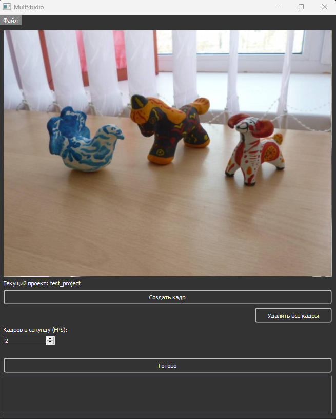

# multstudio


MultStudio is a simple, lightweight, and absolutely free animation creation application that utilizes a sequence of frames captured from a webcam. In the current market, it's challenging to find a solution that combines ease of use, low resource consumption, and zero cost all in one package. MultStudio fills this gap, offering users the ability to create projects, capture frames, and export them as MP4 video files without any associated fees. Whether you're a hobbyist, educator, or just looking to experiment with animation, MultStudio provides a user-friendly platform to bring your creative visions to life.


## Features

- Real-time frame capture from a webcam.
- Saving captured frames within a project.
- Deleting individual frames or all frames of a project.
- Adjusting the frames per second (FPS) for video export.
- Exporting animation as an MP4 file.

## User inteface




## Getting Started

To get started with MultStudio, follow these steps:

1. Install python (tested on 3.9)

2. Install the required dependencies:

```bash
pip install PyQt5 opencv-python
```
3. Run the application:

python app.py

## Usage

Upon launching the application, a dialog window will open where you can create a new project or open an existing one. After selecting or creating a project, you will be able to capture frames, delete them, and export to video.

## Future Enhancements

- **Standalone Executable**: run the application across various platforms without the need for a separate Python environment.

- **Light Theme Support**: alternative visual option, improving accessibility.

- **Music Integration**: ability to add background music to the video projects, allowing for a more complete and engaging storytelling tool.